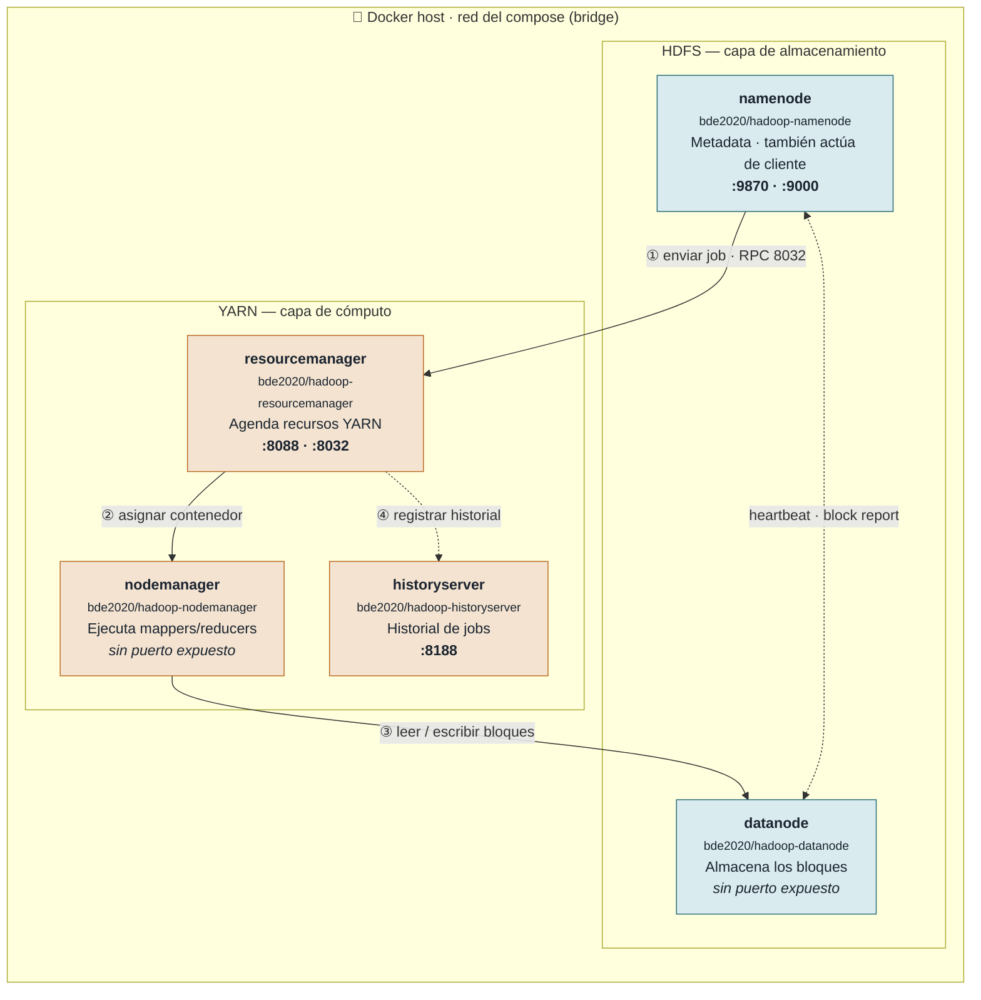

# Arquitectura HDFS + YARN

Los cinco contenedores de `docker-compose.yml` sobre una misma red de Docker: HDFS guarda los datos, YARN agenda y ejecuta el job, y `hadoop jar … wordcount` corre distribuido de verdad en vez de en modo local.

**Cinco contenedores, una red bridge.** YARN (arriba) programa y ejecuta el trabajo; HDFS (abajo) lo almacena. Los pasos ①–④ son el ciclo de vida de `hadoop jar … wordcount`; la línea punteada entre `datanode` y `namenode` es el protocolo continuo de heartbeats, independiente de cualquier job.

## Flujo de un job

1. El propio `namenode` hace de cliente: al correr `hadoop jar … wordcount` dentro de ese contenedor, la aplicación se envía por RPC al ResourceManager en el puerto `8032`.
2. El ResourceManager agenda la aplicación y pide al NodeManager que levante los contenedores del ApplicationMaster, los mappers y el reducer.
3. Esos contenedores leen los bloques de entrada y escriben la salida directamente contra el DataNode, resolviendo la ubicación de cada bloque contra el NameNode.
4. Al terminar, el ResourceManager entrega el registro del job al HistoryServer, visible después en `:8188`.

## Servicios del clúster

| Servicio | Capa | Imagen | Puerto en el host | Rol |
|---|---|---|---|---|
| namenode | HDFS | `bde2020/hadoop-namenode` | 9870 · 9000 | Namespace y metadata; también actúa de cliente |
| datanode | HDFS | `bde2020/hadoop-datanode` | — | Almacena los bloques de datos |
| resourcemanager | YARN | `bde2020/hadoop-resourcemanager` | 8088 · 8032 | Agenda aplicaciones y recursos |
| nodemanager | YARN | `bde2020/hadoop-nodemanager` | — | Ejecuta contenedores de mappers/reducers |
| historyserver | YARN | `bde2020/hadoop-historyserver` | 8188 | Historial de jobs finalizados |

> **Nota:** el `nodemanager` no arranca hasta que el healthcheck del `resourcemanager` en `:8088` responde OK; si el clúster tarda en verse completo en `docker compose ps`, es lo normal.

---
